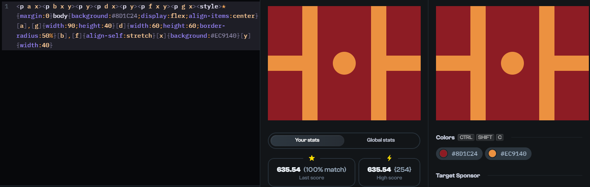

# Repo For Some of my Solutions to CSS Battle Challenges and Notes on These

## Daily Target for 27/9/2023

This daily target is interesting for a few reasons, such as the following:

- This is an example of the use of attribute selectors (albeit silly, made up ones designed to be short). These open up new vistas for handling selection in various senarios. (It should be noted here that [the Spec seems to suggest here](https://html.spec.whatwg.org/#embedding-custom-non-visible-data-with-the-data-*-attributes) that custom attributes should be named `data-` something.)
- This is an example of where `grid` could have been used (or some other form of positioning, such as `position: absolute`) but where `flexbox` can also be used.
- I just discovered that sibling tags don't need to be closed (apparently). This would be one way to reduce character counts for CSS battles.
- Obviously, this is not the way that CSS would/should be written in real-world contexts. So, is CSS battle just a way to learn bad habbits, or a way to practise and extend one's CSS knowledge? Kevin Powell says that it's a good thing to do. So, that's good enough for me. I also like to work on the same problem as others and then see how they'd solve it, so as to learn new methods and approaches.  



```css
<p a x>
<p b x y>
<p y>
<p d x>
<p y>
<p f x y>
<p g x>

<style>
  * {
    margin: 0
  }
  body {
    background: #8D1C24;
    display: flex;
    align-items: center
  }
  [a], [g] {
    width: 90;
    height: 40
  }
  [d] {
    width: 60;
    height: 60;
    border-radius: 50%
  }
  [b], [f] {
    align-self: stretch
  }
  [x] {
    background: #EC9140
  }
  [y] {
    width: 40
  }
</style>
```


## Daily Target for 18/9/2023

The solutions below for this target are interesting for a few reasons. Firstly, even though both of the solutions below match exactly, they didn't scoore 100%. Not sure why. Secondly, the first example is a good example of how clip-paths can be used to save all the grid work. Also, this is an example of gradient 'stops' in use. The CSS Tricks article [HERE](https://css-tricks.com/books/greatest-css-tricks/hard-stop-gradients/) has great examples for how gradients can be used for backgrounds and pretty effects. The clip-path here I created using [this tool here](https://unused-css.com/tools/clip-path-generator). This is a good tool, because you can edit the points.


```css
<div></div>
<style>
  body {
    background: #9076D8;
    margin: 0;
  }
div {
  width: 100%;
  height: 100%;
  clip-path: polygon(0px 0px, 100px 0px, 100px 100px, 400px 100px, 400px 300px, 300px 300px, 300px 200px, 0px 200px);
  background-image: linear-gradient(
    to right,
    #802471 100px,
    #4F0843 300px
  );
}  
</style>

<div id=a></div>
<div id=b></div>
<div id=c><style>
  body {
    margin: 0;
    display: grid;
    grid-template-columns: 100px 200px 100px;
    grid-template-rows: repeat(3, 100px);
    background: #9076D8;
  }
  #a {
    grid-area: 1 / 1 / 3 / 2;
    background: #802471;
  }
  #b {
    grid-area: 2 / 3 / 4 / 4;
    background: #4F0843;
  }
  #c {
    grid-area: 2 / 2 / 3 / 3;
    background: linear-gradient(to right, #802471, #4F0843)
  }
```


## Daily Target for 11/9/2023

This is an interesting example of abstraction - where the border `color` is abstracted into a class with just the `color` property, which allows the `border-left`, etc. properties to be reused in utility classes. The `width` and `height` are also being reused in utility classes, but that is more straightforward. Also worthwhile mentioning is that one can save characters by making the grid on the `body` take up the whole space, rather than using padding to center, or using a grid to center a `div` and then work within that container with its own internal grid, or some other method using flexbox or other. I wonder whether CSS sin/cos/etc. trigonometry could be used here to make shapes around a central point?


```css
<div class="item-b width-height purple left-border top-border"></div>
<div class="item-c width-height purple right-border bottom-border"></div>
<div class="item-a width-height violet right-border top-border"></div>
<div class="item-d width-height violet left-border bottom-border"></div>

<style>
  body {
    margin: 0;
    background: #B5D1FB;
    display: grid;
    grid-template: 75px 75px 75px 75px / 185px 30px 185px;
  }
  .width-height {
    width: 185px;
    height: 45px;
  }
  .right-border {
    border-right: 30px solid;
  }  
  .left-border {
     border-left: 30px solid;
   }
   .violet {
     color: #230259;
   }
   .purple {
     color: #8819F6;
   }
   .top-border {
     border-top: 30px solid;
   }
   .bottom-border {
     border-bottom: 30px solid;
   }
   .item-a {
    grid-area: 2 / 1 / 3 / 2;
    border-radius: 0 750px 0 0;
  }
  .item-c {
    grid-area: 3 / 1 / 4 / 2;
    border-radius: 0 0 750px 0;
  }
  .item-b {
    grid-area: 2 / 2 / 3 / 3;
    border-radius: 750px 0 0 0;
  }
  .item-d {
    grid-area: 3 / 2 / 4 / 3;
    border-radius: 0 0 0 750px;
  } 
</style>
```


## Daily Target for 9/9/2023

This challenge provides an obvious use for CSS grid. It also provides an example of how color declarations should mostly be abstracted to utility classes or CSS custom properties.


```html
<div class="a o"></div>
<div id=b></div>
<div class="c o"></div>
<div class="d o"></div>
<style>
  body {
    background: #E6D9AC;
    padding-top: 52px;
    padding-left: 117px;
    display: grid;
    grid-template-columns: 30px 91px 30px;
    grid-template-rows: repeat(6, 30px);
  }
  .o {
    background: #BD6C27;
  }
  .a {
    grid-area: 1 / 1 / 6 / 3;
  }
  #b {
    grid-area: 2 / 2 / 7 / 4;
    background: #8F2D2B;
  }
  .c {
    grid-area: 3 / 2 / 4 / 3;
  }
  .d {
    grid-area: 5 / 2 / 6 / 3;
  }
</style>
```


## Daily Target for 01/09/2023

In order to complete this challenge, it would, of course, be possible to use absolute positioning. However, it's more pleasing to use CSS Grid to both center within the container (here the `body`) and overlap the grid children. The children are able to be overlapped by assigning them to the same grid area. The `place-self: center` centers every child within grid-area 'a'.

Points of note: 
- assigning two elements to the same grid area overlaps them. This is explained further by Kevin Powell [in this video](https://youtube.com/shorts/ncPwkE10BOY?si=JS22WK8FBvLfHafo).
- using `display: grid; place-content: center;` is an easy way to center content.
- Of course, one could also use `display: flex; justify-content: center; align-items: center;`.


  ```html
  <div id="a"></div>
  <div class="l"></div>
  <div class="l b"></div>
  <div class="l c"></div>
    
  <style>
    body {
      background: #66284A;
      display: grid;
      justify-content: center;
      align-content: center;
      grid-template-areas: "a"
    }
    div {
        background: #F0CD48;
        place-self: center;
        grid-area: a;
      }
    #a {
        border-radius: 50%;
        width: 150px;
        height: 150px;
    }
    .l {
        width: 40px;
        height: 240px;
        border-radius: 20px  
    }
    .b {
        transform: rotate(60deg)
    }
    .c {
        transform: rotate(-60deg)
    }
</style>
  
  ```

## Challenge No. 121. Duck Hunt

This challenge can be solved using a combination of `linear-gradient`, `box-shadow`, and absolute positioning. The background of course, could be made with flexbox, or grid, or just block-level components. But the linear-gradient solution saves characters. Also, ordering the `<div>` elements in the HTML as they are removes the need to use `z-index` to layer the tree trunk under the leaves. An 'optimised' (but unreadable) version of the same which saves characters is added below.


Normal: 
```html
<div id="tree"></div>
<div id="foliage"></div>
<style>
  body {
    background: linear-gradient(#1E92FF, #1E92FF 60%, #69D10A 60%, #69D10A 73.3%, #6F6100 73.3%);
  }
  #foliage {
    position: absolute;
    left: 40;
    top: 60;
    width: 40px;
    height: 40px;
    background: #69D10A;
    border-radius: 50%;
    color: #69D10A;
    box-shadow: 20px 20px, -20px 20px, 0px 20px, 270px 70px, 270px 90px;
  }
  #tree {
    position: absolute;
    left: 50px;
    top: 80px;
    background: #441A0A;
    height: 100px;
    width: 20px;
  }
</style>
```

'Character optimised`:
```html
<div id="t"></div><div id="f"><style>body{background:linear-gradient(#1E92FF, #1E92FF 60%, #69D10A 60%, #69D10A 73.3%, #6F6100 73.3%)}#f{position:absolute;left:40;top:60;width:40;height:40;background: #69D10A;border-radius:50%;color:#69D10A;box-shadow:20px 20px, -20px 20px, 0px 20px, 270px 70px, 270px 90px}#t{position:absolute;left:50;top:80;background:#441A0A;height:100;width:20}
```

